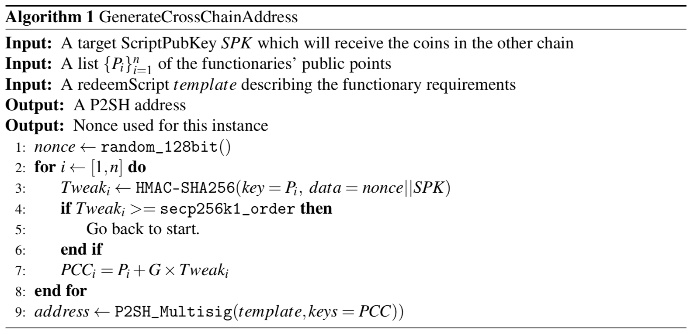

### 7 Acknowledgements 

Gavin Andresen, Corinne Dashjr, Mathias Dybvik, Daniel Folkinshteyn, Ian Grigg, Shaul Kfir, midnightmagic, Patrick Strateman, Kat Walsh, and Glenn Willen 에게 특별히 감사의 말씀을 전합니다. 

#### Appendix A Federated Peg 

페그된 사이드 체인을 deploying 하는데 있어서 현재 큰 문제점 중 하나는 비트코인 스크립트가 현재 SPV 증명을 인코딩할정도로 expressive 하지 않다는 것입니다. 요구된 expressiveness 는 안전하고 호환되며 고도로 compartmentalised 된 방법으로 더해질 수 있다. (예를 들어, no-op 을 소프트 포크를 통해 OP_SIDECHAINPROOFVERIFY 으로 변환할 수 있다.) 그러나, 새로운 합의 알고리즘을 만드는 것, 심지어 간단한 새로운 기능을 배포하는 것 조차도 쉽지 않다. 이러한 어려움들을 recall 하는 것이 페그된 사이드 체인을 시작하는 주된 동기 중 하나였다. 비트코인에 사용될 미래의 스크립트 기능들을 그 어느 곳에도 배포하지 않은채로 시도해보는 것이 우리가 하고 싶은 것이다. 

다행히도, 몇가지 추가적인 security assumptions at the expense of the low trust design objective, 완벽한 비허가형 방법으로 initial deployment 하는 것이 가능해졌다. 지켜보아야 할 점이 있다. 비트코인 스크립트의 기능 향상은 상호간에는 신뢰하지 않는 functionary 들로 구성된 신뢰할 수 있는 federation 을 가짐으로써 externally 하게 구현될 수 있다. 이 functionary 들은 script 를 evaluate 하고 일반적인 다중서명 스크립트를 서명하는 방식으로 채택된다. Functionaries 들은 비트코인을 평가하는 같은 방식으로 규칙을 평가하여 protocol adaptor 로서 행동할 수 있지만 스크립트 enhancement 의 부족으로 할 수 없다.  

이 방법은 다중 서명 오프체인 거래 시스템을 구현하는 방법과 상당히 비슷하다, 하지만 필요한 서버간 합의 프로세스는 블록체인을 의문 시각으로 바라봄으로써 제공된다. 결과는 결정론적이고, functionnary 들의 선택과 감독을 단순화시켜주는 고도의 감사 가능 기능을 가지고 있다. 이러한 유사성 때문에, 많은 기술들은 보안성을 높이고 and confidence in off-chain payment systems can be employed for federated pegs. 예를 들어 functionaries 는 지리적으로 퍼져있을 수 있고, 에스크로 된 혹은 생성하는데 비용이 많이 들고 coercion-resistant 한 익명의 신원 코인에 bond 되어 있을 수도 있거나, 원격 인증 변조 방지 하드웨어에 구현되었을 수도 있다 [Tod13]. 더 작은 규모에서는, 해당 시스템에서 코인의 소유자들은 그들 스스로가 functionaries 로서 활동할 수 있다, 그럼으로써 제 3 기관의 신뢰를 회피할 수 있다. 

federated peg 를 사용하는 사이드 체인들이 사용되고 있으면, SPV 검증을 비트코인 스크립트에 추가하는 것은 시스템에 필요한 신뢰를 줄여주는 단순한 보안 업그레이드로 볼 수 있습니다. 현존하는 사이드체인에서는 단순히 그들의 코인을 새로운 검증 시스템으로 옮길 수 있다. 이는 추가적인 보안 옵션을 가능케한다 : 채굴에 의해 제공된 DMMS 의 경우에는 작은 시스템에서는 별로 안전하지 않다, 왜냐하면 규모가 큰 시스템이 더 위험하기 때문이다. 사이드 체인은 could adaptively use both of these approaches in parallel, or even switch based on apparent hashrate.

비트코인과 two-way 페깅을 하는데 있어서 3 of 5 federation of functionaries 를 사용하는 사이드 체인을 생각해보자. federation 에는 secp256k1 공개점(공개키) P1, P2, P3, P4, P5 가 있다. redeemscript template 3 x x x x x 5 OP_CHECKMULTISIG 은 사이드체인 내 모든 참가자들에게 알려져 있다. 코인을 ScriptPubKey SPK 에 보내려면, sidechain 에서 코인을 사용할 수 있게 하고 싶은 유저는 federation 페그를 사용하여 cross-chain P2SH 주소를 계산한다. 그 과정은 아래와 같다 : 

이 derivation scheme 은 BIP32 에서 사용된 homomorphic 기술과 같다. BIP 32 는 공개적으로 연결할 수 없는 주소를 제 3자가 파생할 수 있게 한 proposal 이다. pay-to-contract 거래와 같은 기반 construction 이다. 주소가 생성된 후에, 코인은 그곳에 지불될 수 있다. and the user can later receive the resulting coins on the sidechain by providing the functionaries with the nonce, ScriptPubKey, and an SPV proof to help them locate the payment in the blockchain. 사이드체인의 제 3자 검증을 지원하기 위해서 이 값들은 사이드체인 그 자체에 저장될 수 있다. 왜냐하면 거래는 표준 P2SH 주소에 지급함으로써 셍성되고 모든 ScriptPubKey 에 지불될 수 있다, 다중서명 주소에 지급할 수 있는 모든 비트코인 서비스는 federated 사이드체인을 사용하는 유저에게 바로 지급할 수 있고 지급받을 수 있다. 

Federated peg 는 신뢰 측면에서는 타협을 했어야 했지만, 비트코인을 바꿀 필요는 없다 - 참여자들만 이를 사용한다는 것에 동의를 하고 이를 사용함으로써 발생하는 비용과 위험성을 부담하면 된다. 그리고, 만약 특정 주체가 다른 사람들이 사이드체인 사용하는 것을 막고 싶다고 해도 막을 수 없다 : 만약 federated peg 가 폐쇄형 커뮤니티에서 사적으로 사용되게 된다면, 그 사용처는 추적 및 감사 불가능하다. 이러한 접근법은 급진한 deploy 와 실험을 가능케하고 비트코인 프로토콜에 직접적인 변화를 적용하기 전에 peg 된 사이드 체인에서 먼저 변화를 일으킨 후에 적용을 할 수 있게 한다. 
