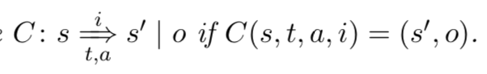
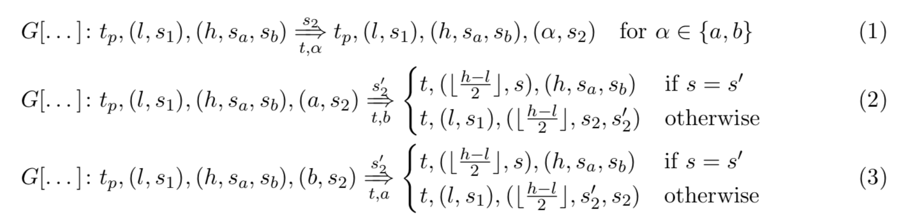
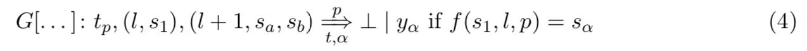
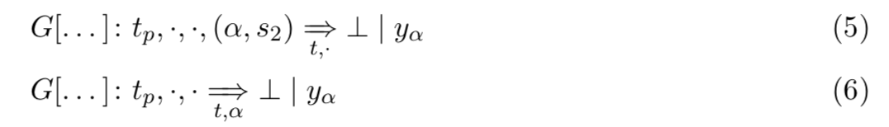

# Truebit Light's Incentive System - Work in Progress - 

Christian Reitwiebner
chris@ethereum.org

## page 1

블록체인은 탈중앙화된 상태에서 실행되는 프로그램들이 정확하게 실행되는 것을 합리적으로 확신시켜준다. 거래가 승인되었다는 것을 보장하지 않는다, 또한 승인된 거래가 지속적으로 승인된 상태로 남는다는 것 역시 보장하지 않는다. 하지만 시간이 흐름에 따라서 상태가 바뀔 확률은 지속적으로 감소한다. 

블록체인의 가장 주된 문제점은 그들의 확장성이다: 시간당 발생할 수 있는 계산량은 어느정도 고정되어 있다. 더 많은 참가자가 네트워크에 참여한다고 해도 증가하지 않고, 그 네트워크에 속해 있는 노드들 중 가장 느린 노드에 제한된다. 

TrueBit 은 이 문제를 interactive verification 으로 해결하고자 한다. 최소한 1명의 정직한 참여자가 있다는 가정하에서 다소 복잡한 계산을 수행한다. 그렇다고해서 참여자들이 이타적인 행동을 할 것 을 요구하지는 않는다.  TrueBit 은 단점도 가지고 있다. 거래가 승인되는데 보통 더 많은 시간이 걸리고 공격자가 재정적 재원이 충분하다면 공격자에 의해서 임의적으로 승인이 지연될 수 있다. 이 시스템은 정확도(correctness) 를 활성도(liveness) 보다 우선시 한다. 최소한 1개의 정직한 참가자가 있다면, 부정확한 computation/transaction 을 포함시키는 것은 불가능하다. 하지만 공격자는 옳은 computation/transaction 을 포함시키는 것을 임의로 늦출수는 있다.

본 글에서는 Dogecoin-Ethereum bridge 에 특정하여 서술해보려고 한다. Dogecoin-Ethereum bridge는 Dogecoin 블록체인의 블록들이 Ethereum smart contract 에서 검증되어야 한다. 이 검증을 직접적으로 진행하게 되면 비용이 많이 든다. 그래서, 트루빗을 활용한 off-chain 계산을 할 것이다. 

Having  said  that,  모든 분석은 block 의 availability 가 합리적으로 예상될 수 있는 bridge들에게 동등하게 applicable 하다. 이 말은 이것들은 processing volume 을 메인 이더리움 체인에서 다른 체인으로 (그것이 PoA 일수도 있음) offload 하는데 사용될 수 있다는 것이다. 해당 체인에 있는 모든 참가자들이 블록의 세부정보가 모든 잠재적인 도전자들에게도 사용될 수 있는 것임을 rigtfully assume 하고 있는한.

Truebit-light 프로토콜이 정직한 참가자들을 네트워크로 끌어오는 것으로 생각하지 않는다.(의역) 어느 정도 이타적인 참가자가 있는 것으로 가정한다. 이는 이더리움 네트워크 유지, 가스비 지불, 예치금으로 두는 일정량의 자금 등을 포함한다. 

또한 오직 1개의 병렬 작업만을 허용하는 수준으로 시스템을 간소화(simplify) 시킬 것이다. 이는 특정 양만큼 일의 양으로 확장될 수도 있으나 또한 여기서 그 presentation 은 훨씬 복잡하게 된다. (번역 개선필요)

## page 2

모든 타임아웃들은 lower bound 이고 ethereum 네트워크의 혼잡을 대비하여 확장되어야만 한다. 만약 timeout 을 claim 하여 효과를 얻고 싶다면, 이전의 여러개의 블록들이 또 다른 party 에게서 오는 잠재적인 response 를 포함할 수 있는 충분한 capacity 갖고 있음을 증명해야 한다. Truebit 은 절대  상태 변환(state transition)이 정해진 일정 시간 안에 이루어지는 claim 을 만들지 않기에 아래에서 제시된 이론과 여전히 일치한다. 

TrueBit 컨트랙트는 다음과 같은 속성이 있습니다: 

TrueBit 은 fact claiming component 와 verification game 으로 구성되어 있다. 두 경우 모두, 수학적인 function f : Σn → Σn 를 fix 한다. function f 는 주어진 machine 에서 s개의 elementary computation step 들로 구현될 수 있다. f 가 또 다른 machine 에서 interpreter 가 될 수 있기에 큰 limitation 은 아닐 것이고 유한한 running time 을 가지고 있는 arbitrary  프로그램들을 수행할 수 있다. running time 제한의 그 크기가 해당 블록체인의 1개 블록에서 계산할 수 있는 크기보다 클 수도 있지만, 그럼에도 불구하고 이는 매우 중요한 요소이다.

smart contract 시스템을 다루는데 도움이 될 언어를 설명하는 것으로 시작하려고 한다.

**Definition 0.1.** 

A 를 모든 계정의 세트로 T 를 모든 timestamp 의 세트로 설정하자. smart contract C 를 T × A × I (timestamp, sender and input) 으로 부터 input 을 받는 state machine 으로 설정하고 input 에 따라서 S 로부터 상태를 변환하고 O 으로 부터 output 값을 생성해낸다. 여기서, I, O 와 S 는 각 smart contract 타입에 따라 달라진다.

smart contract 는 그 상태 변환 함수 (state transition function) C : S × T × A × I → S × O 으로 식별된다. 함수는 부분적 함수이다. (partial function)

machine 은 특정 input 값에 대해서는 거부를 할 수 있다. Smart contract 는 정상적인 이전 input 의 timestamp 보다 높지 않은 timestamp 를 가지고 있는 것들은 모두 거절한다. C 는 또한, iterated state transition function C : (T × A × I)∗ → S × O 으로 식별된다. 묵시적 초기 상태 S0 를 (s0, o0) = C(ε) 으로 가정한다. iterated state transition function 은 (s′, o′) = C(In) 일 때, C(In, (t, a, i)) = C(s′, t, a, i) 이렇게 유도될 수 있다.

이를 간단히 표현하자면 다음과 같다.  

a ∈ A 인 플레이어 a 에게는 S → (T ×I)∪{⊥} 라는 전략이 있다. (⊥ 는 플레이어가 아무런 움직임을 일으키지 않았을 때를 의미한다.) 

strategy assignment S : A → (S → (T × I) ∪ {⊥}) 에서 S 에 따른 smart contract C 의 게임 g는  일련의 움직임들이다. i.e. g ∈ (T × A × I)∗ such that C(g) is defined and g 는 g = ε (빈 게임) 또는 g = g′ ·(t,a,i) 인 상황이다. g′ 는 C에서의 게임이다. 

그런데 C 는 C(g′) = (s,o), S(a)(s) = (t,i) 이며 S(a′) = (t′,i′), t′ < t 인데 C(g′ · (t′, a′, i′)) 정의된 a' (a′ ∈ A) 는 없는 상태이다. game 의 길이는 round 의 숫자로 불리운다. 

S:A → (S → (T ×I)∪{⊥}) 에 관한 설명이다. S 에 따른 C 안에 있는 게임 g 중 어느 하나라도 C(g) = (s,o) 를 만족하는 것이 있다면 C ~ → S o 라고 적는다. 

a∈A 인 player a 의 개별 strategy function s:S→T×I∪{⊥} 을 C~ →s o 이렇게 쓴다. C~ →s o 은 모든 S 에 대해서 S(a) = s 인 경우에 사용된다. (이것도 화살표가 개판이 되네)

**Theorem 0.2.** 

s 스텝들을 계산해야하는 모든 함수 f 에는 interative game 이 있다. game 에는 a,b 2명의 참가자가 있으며 smart contract 에 의해 진행된다. smart contract G[a, b, ., ., .] 는 아래의 특성을 가진다.

1. 최대 1+2 log2 s 의 round 가 돌아가고 최대 tG log2 s 의 시간이 소비된다. for some intra-round timeout tG

2. 모든 x, y 에게 선수 a 를 위한 전략 s가 존재한다. 
전략 s 는 G[a, b, x, f(x), y] ~->s f(x) 이다.

3. 모든 x, y 에게 선수 b 를 위한 전략 s 가 존재한다. 
전략 s는 G[a,b,x,y,f(x)] ~->s f(x) 이다. 

## page 3

*Proof.* 게임은 불변성을 유지한다. 두 선수 모두 l 단계에서의 내부 상태 computation 결과는 일치하지만, h 단계에서는 불일치한다. 내부 state 의 해시값으로도 작업을 진행할 수 있다, 이를 통하여 매 round 마다 전송되는 data 가 그렇게 크지 않게 된다. 

초기에, l=0 이고 h=s 인 상태이다. 그리고 game 은 매 second message (round) 마다 거리 h-l 을 절반으로 줄인다.

t0 를 게임이 생성된 timestamp 로 설정하자. 초기 상태는 다음과 같을 것이다. 

G [a, b, x, ya, yb, t0] (ε) = (t0, (0, x), (s, ya, yb))

이후의 모든 메세지들은 state 에 있는 timestamp 보다 커야 한다, i.e. 절대적인 조건 t > tp 가 필요하다. 그리고, 이후에는 G 의 parameter 들은 생략할 것이다. 그리고 α 를 generic accounts 로 사용할 것이다. 이는 a 혹은 b 모두 될 수있다. 

If h − l > 1 인 상황에서는, 양쪽의 참가자 모두에게 그들이 생각하는 ⌊ h−l/2 ⌋ 단계에서의 internal state 를 제출 받는다. 

h-l = 1 이 되면, smart contract 는 아래의 계산을 실행한다 : 

 f(s,i,p)를 알고리즘의 내부 상태라고 가정해보자. 알고리즘은 i 단계 부터 단일 단계를 실행 후 f 를 계산하며 내부 상태 s 는 보조 증명 데이터 p 를 고려한다.(만약 p 가 잘못되었거나 유효하지 않으면 값은 정의되지 않는다.)

 

 게다가, 특정 시점에 t > tp + tG 가 되면, timeout 이 선언된다. 

 

 최악의 경우에 게임 round 의 숫자를 한번 계산해보자. timeout 은 어느 상태이던지 게임을 바로 끝낼 수 있다. 메세지 타입 (1) 그리고 (2),(3) 모두 h-l 을 반으로 줄인다. 타임아웃을 제하고는, h=l+1 의 상태가 될 때까지 이들이 메세지의 형태로 가능한 유일한 경우들이다. h=l+1 의 시점에서는 오로지 메세지 (4) 만이 가능하다. 

## page 4

만약 timeout 이 없다면, 게임은 1 + 2log2s 만큼의 메세지가 필요할 것이다. 

(1), (2) 그리고 (3) 의 timeout 은 모두 같은 시간에 시작된다. 이 말은 양쪽 모두 h-l 의 크기 감소를 수행하는데 있어서 tG 만큼의 시간이 걸린다는 것이다. 만약 이것이 tG 보다 오래 걸린다면, 누구든지 게임을 종료시킬 수 있다. 즉, 게임이 걸리는 최대 시간은 tG log2 s 으로 한정된다.(assuming there is an actor who will trigger the timeout)

마침내, 우리는 왜 양쪽 선수 모두가 게임을 끝내는데 있어서 f(x)를 사용하는지에 대해서 논한다. 대칭 형태이기에, 오직 a 선수에 대해서만 논하려고 한다.

당연히, 시간 내의 응답으로, a 는 f(x) 와 다른 상태에서 timeout 으로 게임이 끝나는 것을 방지할 수 있다. 

만약 game 의 현 state 가 tp, (l, s1), (h, sa, sb) 이라면, 전략은 ⌊ h−l / 2⌋ 단계에서 알고리즘 컴퓨팅 f 의 내부 상태를 포함한 메세지를 보내는 것이다. 그렇게 함으로써, smart contract 는 상태 tp,(l,s1),(l+1,sa,sb) 에서 끝내게 된다. 

여기서 s1 은 l 단계에서의 상태이고 sa 는 l+1 단계에서의 상태이다. sb와 sa 는 같지 않고 알고리즘 컴퓨팅 f 는 결정적이기 때문에, b 는 smart contract 를 yb 의 상태로 바꾸기 위해 (4) 형태의 메세지를 사용할 수 없다. 대신 (4) 를 ya = f(x) 의 smart contract output 을 만들기 위해 사용할 수 있다. 

할 일 : 나머지 statement 들 수식화하고 증명하기.
