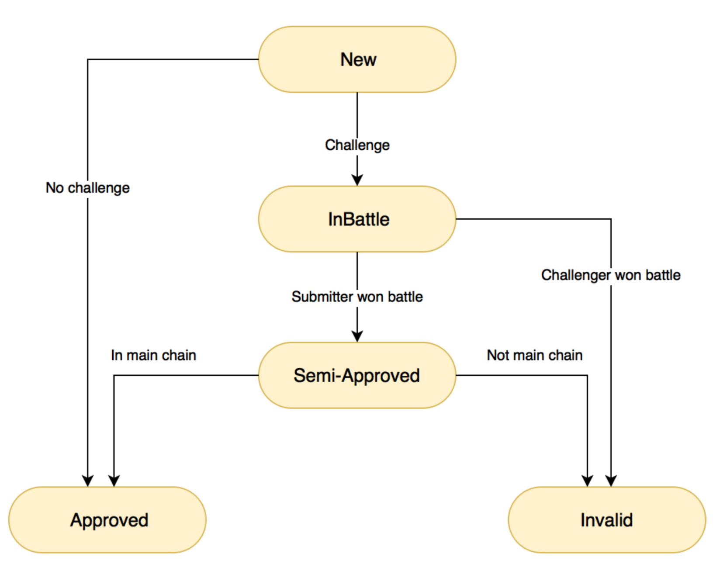

# Using Superblocks to Bridge Dogecoin to Ethereum

July 31th, 2018  
Revision : 3 

Ismael Bejarano ismael.bejarano@coinfabrik.com  
Oscar Guindzberg oscar.guindzberg@gmail.com

## 개요 

Doge 와 ETH 를 이어주는 브릿지의 경우 (이더가 450 달러였을 때) 도지 블록체인과 지속적인 연결을 위해 하루에 가스비로 10달러 이상의 돈이 요구된다. 우리는 도지 블록 헤더가 이더리움에 제출되지 않아도 되는 시스템을 제안하려고 한다. 대신, 지난 1시간 동안 채굴된 모든 도지 블록들의 헤더들로 머클 트리를 만들어 그 루트 값을 Superblock Contract 에 제출하려고 합니다. 검증자는 challenge/response 를 시작하여 제출된 루트 값의 정오답 여부를 확인할 수 있다. 

## 동기 (Motivation)

Dogecoin-Ethereum 브릿지를 만드는데 있어서 첫 접근법은 BTCRealay 를 Solidity 로 포트하는 것이었다. BTCRelay 는 모든 새로운 비트코인 블록 헤더가 컨트랙트에 제출될 수 있게 하고 이로써 특정 블록에 거래가 있음을 검증할 수 있게된다.

BTCRelay 의 경우에는, 80 byte 의 블록 헤더를 저장하는 200k 가스가 소비된다. 이 블록헤더가 매일 144개 저장되어야 한다. 가스 가격은 10 gwei 일 때, 스토리지 저장으로만 하루에 0.288 이더를 소비하게 된다. 

이더리움의 성공이 엄청난 비용이 증가를 야기한다 : 이더당 900 달러 일때 BTCRelay 운영을 하는데 있어서 하루에 259.2 달러가 소비된다. 더 낮은 가스 값을 사용할 수 있지만, 네트워크 사용량의 증가로 수수료가 높아졌고 높은 수수료를 제출하지 않는다면 해당 거래가 채굴되는데 더 많은 시간이 걸리게 된다. 

도지코인은 1분에 1개씩 블록을 생성한다; 스크립트 해시 검증에 challenge/response 시스템을 사용한다고 해도 같은 블록 헤더 기준으로 Doge -> Eth 브릿지 비용 사용에 BTCRelay 의 10배가 사용된다. 이에 더해서, 도지코인은 merge mined 된다 : 블록 헤더는 더 크고, 평균 700 byte 이고 이 데이터는 추가적인 검증을 필요로 한다 그리고 이것이 비용을 증가 시키고 prohibitive 하게 만든다. 

## Superblocks (슈퍼블록)

Efficiently Bridging EVM Blockchains 기사에서 영감을 받은 부분이 있다. 비용 절감 하는 방법 중 하나인데, 모든 블록 헤더를 저장하는 것이 아니라, 여러 블록들의 머클트리의 루트 값만을 저장하는 것이다. 

그래서 우리는 일정 범위의 블록들을 대표하는 "superblock(슈퍼블록)" 을 전송하고 저장하는 방법을 제안한다. 이는 아래의 정보들을 포함할 것이다: 

- 블록 해시값들로 형성된 머클트리의 루트 값 
- 블록들의 누적 난이도 값 
- 마지막 superblock 의 해시 값
- 마지막 superblock 의 타임 스탬프 값 
- 부모 superblock 의 데이터의 해시 값 

여러 개의 블록들을 그룹화하여 하나의 superblock 을 만들며 비용을 최소화 될 것이다. 매 시간 60개의 700 바이트 블록들을 전송하고, 검증하고 저장하는 대신 오직, 200 바이트가 채 안되는 1개의 superblock 만을 저장하면 된다. 

tradeoff 가 존재하기는 한다 -- 더 많은 블록들이 하나의 superblock 에 담기면, 더 많은 비용이 절감되지만 거래 하나를 relaying 하는데 더 많은 시간이 소비된다. 1시간당 1개의 슈퍼블록이 생성되는 것은 임의의 결정일 뿐, 더 많은 데이터가 가용될 때 새롭게 결정될 것이다. 

슈퍼블록들은 on-chain 상에서 거의 검증되지 않는다. Superblock들은 challenge/response 시스템에 의하여 검증될 것이다.

이전 superblock 의 정보는 superblock 들끼리 연결하기 위해서 포함되어 있다; superblock 들의 체인이라고 생각하면 될 것이다. 이전 superblock 들을 confirm 하는 것을 촉진시키고 공격 받을 것이라고 고려되는 작은 fork 들의 superblock 들은 무시하게 한다.

### Relaying transactions 

Doge 토큰을 받기 위해서, 사용자는 lock 주소로 보낸 거래의 SPV 증명 superblock 컨트랙트 뿐 아니라, 해당 거래가 속해 있는 블록의 SPV 증명이 특정 superblock 의 일부라는 것을 증명해야 한다. 

## Security Assumptions 

우리는 해당 솔루션을 구성하는 요소들(Doge 블록체인, Ethereum 블록체인, Challenge/Response 메카니즘, BtcRelay)은 안전하다고 가정한다. 

- Dogecoin 블록체인의 대다수의 마이너들은 정직하다 : 개인 혹은 특정 그룹의 채굴자들이 가장 긴 메인 Dogecoin 블록체인을 만들 정도로 많은 해시파워를 가지고 있지 않는다. 이는 long range attack 을 저지한다, 왜냐하면 가능성 있는 모든 포크의 누적 난이도가 메인 체인보다 낮기 때문이다. 

- Ethereum 블록체인을 채굴하는 대부분의 주체는 정직하다. 

- 대규모 체인 reorg 는 일어나지 않는다. (100개 이상의)

- 그 어느 누구도 금전적인 피해를 입는 것을 원치 않는다 : 공격을 하는 이유는 이득을 얻기 위함이거나 최소한의 비용으로 피해를 입히기를 원한다. 그 누구도 아무 이유없이 특정 상황에 대한 거부나 네트워크 혼란을 야기하지 않는다, 이는 단지 공격하는데 있어서 돈만 소비되기 때문이다. 

- 우리는 블록체인이 가지고 있는 고유의 문제는 해결하지 않으려고 한다. : eclipse attck

- challenge/response 메카니즘은 항상 작동하는 것으로 가정한다. 예를 들면, 적어도 1개의 정직한 검증자는 항상 온라인 인것으로 간주된다. 

- Dogecoin 은 PoW 알고리즘을 고치거나 PoS 로 변경하지 않는다. 

- Dogecoin 은 header 나 거래의 format 을 바꾸지 않는다. 

## Validation 

우리는 1시간에 1개의 Supberblock 을 제출할 것이다. (약 60개의 Dogecoin 블록을 대표한다.) 이는 그냥 추가적인 실험을 위한 임의의 결정이다. 

체인 reorg 를 피하기 위해서, superblock은 마지막 블록이 채굴되고 3시간 안에 새로운 superblock 이 채굴되지 않을 것이다. 예를 들어, 오후 2시에서 3시에 보낸 블록들이 오후 6시에 보내진 superblock 에 담기게 된다.

superblock 승인 최소 3시간 간격은 제출자가 실수로 small fork 를 보내는 것을 확률적으로 최소화한다 ; 이는 현재 임의의 값이다. 앞으로 추가적인 평가를 한 후에 수정될 수도 있다.

우리는 이 기간 동안 정확히 메인 체인의 블록을 포함하지 않은 superblock 들은 공격으로 간주할 것이다, 왜냐하면 누군가가 작은 포크를 실수로 제출할 가능성은 무시할 수 있기 때문이다. 

superblock 들의 검증은 challenge-response 프로토콜을 사용함으로써 해결된다. submitter 와 challenger 모두 예치금을 내야 한다. 그래야 가짜 submission 을 막을 수 있기 때문이다. challenge 의 승자는 패자의 예치금을 가져가게 된다. 

제출자가 challenge 에서 승리해도 바로 예치금이 복구되지 않는다. 해당 superblock 이후에 몇 개의 추가적인 superblock 들이 검증된 후 복구된다.(아래의 “Superblock with blocks not in the main chain” 부분에 더 자세히 설명되어 있다.)

## Superblock states

- New : superblock 이 막 도착했을 때 , 검증자는 challenge 를 걸 수 있다. 
- InBattle : 검증자가 challenege 를 걸어 놓았지만, 아직 battle 이 끝나지 않은 상태이다. 
- Semi-Approved : 제출자가 battle 에서 승리하였지만, 또 다른 superblock 이 검증되기를 기다리고 있는 상태이다. 
- Approved (Final State) : superblock 이 유효하다. 
- Invalid (Final State) : 제출자가 battle 에서 졌다. 

### Superblock verification battle 

제출자(submitter) 와 도전자(challenger) battle 을 진행하는데 있어서 순서대로 contract 에 메세지를 보낸다. 일정 시간내에 답변을 보내지 않으면 전투 포기로 간주되고 상대편의 승리로 선언된다. 

1. 제출자 (submitter)  : 예치금을 건다. 
2. 제출자 (submitter)  : superblock 을 보낸다, 예치금은 lock 된다. superblock 상태는 New 가 된다. 
3. 도전자 (challenger) : 예치금을 건다. 
4. 도전자 (challenger) : 도전을 건다, 예치금이 lock 된다. superblock 상태는 InBattle 이 된다. 
5. 제출자 (submitter)  : 슈퍼블록에 모든 블록 해시값들을 array 를 보낸다. (that are used to form the Merkle tree that relates them to superblock root hash). 블록 해시값들과 머클 트리 그리고 루트 해시 조합은 on-chain 에서 검증된다. 
6. 도전자 (challenger) : 블록 헤더를 요청한다. 
7. 제출자 (submitter)  : 요청된 블록 헤더와 scrypt hash 값을 전송한다. 블록 헤더는 on-chain 에서 검증된다. 
8. 오프체인에서 트루빗 상호작용 스크립트 해시 검증
9. 6,7,8단계는 모든 블록들이 전송될 때까지 지속적으로 반복된다. 
10. 모든 블록이 전송되면 : 
    a. 블록들의 on-chain 누적 난이도가 superblock 의 누적 난이도와 일치하는지 확인한다.
    b. superblock 이 이전 superblock 이 제출된지 3시간 후에 제출되었는지 확인한다.  
11. 만약 모든 단계가 성공적으로 작동되었고 모든 도전자들이 battle 에서 패배하면 해당 superblock 은 Semi-Approved 상태가 된다.
12. 만약 제출자가 패배하면, 해당 superblock 은 Invalid 상태가 된다. 

만약 제출자가 battle 에서 패배하면, superblock 은 즉시 유효하지 않은 것으로 판단되고 도전자는 제출자의 예치금을 상금으로 얻는다. 

만약 도전자가 포기하면, 새로운 도전자가 스스로의 예치금을 건 후에, 새로운 도전을 걸 수 있다.

만약 모든 도전자가 battle 에서 패배하면 superblock 은 semi-approved 상태가 된다. 하지만, 예치금들은 메인 체인에 들어갈 이후의 superblock 들에 의해서 검증될 때까지 lock 되어 있는다. 

새로운 superblock 들이 해당 superblock 을 조상으로 잡은 상태에서 도착하게 되거나 제안된 다른 superblock 들 보다 더 많은 축적된 PoW 가 쌓여있으면 semi-approved superblock 으로 고려될 수 있다. 

만약 superblock 이 main chain 에 속해 있지 않게 되면 제출자의 예치금은 도전자에게 지급된다. 여러 명의 도전자들이 있는 경우에는 모든 도전자들이 각자 예치금의 비율에 맞게 지급된다. 

## Possible attacks 

### Superblock submitted before 3 hours have passed 

마지막 superblock 의 타임스탬프를 검증에 사용한다. 이렇게 진행하는 이유 중 하나는 정직한 제출자가 제출한 superblock이 유효하지 않은 것으로 취급되는 작은 포크를 낼 가능성을 최소화하기 위해서이다.

이 조건 역시 공격자가 임의의 긴 포크에서 timestamp in the future 로 블록 채굴하는 것을 방지한다. 

### Attacker submits superblocks while all verifiers are offline 

만약 모든 검증자들이 짧은 기간동안에 오프라인이라면, 공격자는 다수의 가짜 superblock 들을 그 기간 동안 제출 할 수도 있을 것이다. 

이 공격의 성공확률을 낮추기 위해서, 매 30분 안에는 1개 초과의 슈퍼블록의 유효성이 승인되지 않는다. 이는 즉,부모 자식 블록간에  최소한 30분 이상의 시간 차이가 있어야 한다는 것이다.

이런 superblock 간 최소간격 시간은 long range attack 의 동기를 낮춘다. 누군가가 임의의 긴 체인을 과거의 한 블록부터 채굴해 나갈 수 있지만, 제출에는 긴 시간이 걸리고 그 사이에 메인 체인도 같이 성장하고 있기 때문이다. 

### Superblock with blocks not in the main chain 

한가지 가능한 공격 방법은 모두 유효하지만, 그 중 일부는 현재 메인 체인에는 포함되어 있지 않는 도지 블록을 담고 있는 superblock 을 보내는 것이다; 예를 들어, superblock 의 마지막 블록은 공격자에 의해서 채굴된 고아 블록일수도 있다. 

만약 슈퍼블록이 일시적인 포크에 담긴 블록을 담고 있다면, 이에 대한 challenge 는 성공적으로 끝나지 않을 것이다. 왜냐하면 모든 데이터가 도지 블록체인에서는 유효한 것으로 취급되기 때문이다.(그것이 메인 도지 체인의 일부인지 아닌지 여부는 관계없다).

공격자는 스스로 만든 "가짜" 체인의 지속적인 성장을 위해 "가짜" superblock 을 공격한 블록 위에 지속적으로 보낼 수도 있다. 매 가짜 superblock 은 공격자에 의해서 채굴된 최소 1개의 고아 도지 블록을 포함할 수도 있다. 시간당 1개의 고아 도지 블록을 채굴하는 비용은 상대적으로 낮다. 

superblock 에 challenge 가 걸려왔고 제출자 (i.e. the attacker) 가 battle 에서 이겼다면, 해당 superblock 은 "semi-approved" 으로 취급된다. 예치금은 묶여있을 것이고 아직 superblock 을 거래 relay 에 사용하는 것은 불가능하지만, 이 위에 있는 superblock 들은 승인될 것이다. 

유효한 "superblock" 체인이 지속적으로 성장한다고 가정한다면, 24개의 superblock 후에 (즉, 24시간 후에) challenger 는 예치금 반환과 "semi-approved" 인 superblock 을 "invalid" 한 것으로 판단하라고 요구할 수 있다. 왜냐하면 더 이는 superblock 메인 체인에 속해 있지 않기 때문이다. 반면, submitter 는 예치금 반환과 "semi-approved" 인 superblock 을 "valid" 한 것으로 판단하라고 요구할 수 있다. 만약, 이것이 superblock 메인체인의 일부라면 말이다. 

## Questions and Answers 

- 각 단계별 데드라인이 어떻게 생성되는가? 

각 스테이지의 데드라인이 정해져있지는 않다. 트레이드 오프가 있다 -- timeout 이 높으면 이면 항상 마지막 순간에 회신하여 denial of service 하기가 더 쉽고, timeout 이 낮으면 정직한 참여자가 시간내에 답변을 못할 가능성이 있다. 

- 데드라인은 매 battle turn 마다 상승하나요? 

deadline 은 매 battle 마다 reset 된다. 

- 데드라인들은 수정되나요? 

There's no max time for the battle to resolve.

- What about new superblocks that arrive when a battle is being held?

만약 superblock 이 도착했는데 그 부모 블록이 battle 중이라면, 새로 도착한 그 superblock 은 거부된다. 그렇지 않은 상황이라면, 승인되고 "New" 라고 표시된다. 

For example, an attacker can challenge an honest superblock and send a competing fake superblock at the same time. It is supposed an honest challenger to challenge the fake superblock. The assumption is that the fake superblock will eventually lose the battle and the honest superblock will win.

## Fine tuning 

### Dealing with block timestamps going backwards 

Doge 블록의 timestamp 는 꼭 부모 블록의 timestamp 보다 높을 필요는 없다. (단지 최근 블록들의 중간값(median)보다만 높으면 된다.) 
그러므로, two valid competing superblocks could potentially coexist, leading to two valid competing superblock chains.
아래의 Doge 체인을 가정해보자 

B1 (16:59:58), B2 (17:00:01), B3 (16:59:59), B4 (17:00:02), B5 (18:00:01).

그리고 superblock 체인은 다음과 같다

Superblock chain A: S1 (B1), S2 (B2, B3, B4), S3(B5)
Superblock chain B: S1 (B1, B2, B3), S2 (B4), S3(B5)

2개의 superblock chain 모두 같은 누적 PoW 를 가지고 있다, 그래서 이들은 지속적으로 경쟁을 할 것이다.이러한 문제를 피하기 위해서 ,선의의 독재자처럼, supreblock chain A 가 유효하고 B 는 유효하지 않은 규칙을 하나 만드려고 한다. 예를 들어, 오후 4시부터 5시 사이의 블록에 대한 superblock 을 진행한다면, 그 어떤 블록의 timestamp 도 5시 이후가 되서는 안된다. 
Note: The superblock might contain (most likely in the first couple of blocks) blocks whose timestamp is before 4pm.

### Dealing with long periods without blocks 

예상치 못하게 한 시간동안 블록이 하나도 완성되지 않는 경우에, 해당 시간에서의 superblock 은 생략될 것이다. 

도지 블록체인이 아래와 같다고 해보자 : 
B1 (16:30:00), B2 (16:45:00), B3 (19:20:00).

이 superblock chain 은 다음과 같이 될 것이다 : S1 (B1, B2), S2 (B3).

## Conclusion and next steps 

제시된 해결책은 Doge to Ethereum 페그를 만들 때 가스 사용량을 최소화 할 수 있는 실행 가능한 방법 중 하나이다. 다음 단계는 prototype 을 만들고 추가 공격 방법에 대해서 조사하기이다.

## Acknowledgements 

Many thanks to 피드백을 주신 Jason Teutsch, Sina Habibian and Sergio Lerner 님 에게 정말 감사합니다. 감수를 해주신 Catalina Juarros 님 감사합니다.

## References 

- “Efficiently Bridging EVM Blockchains”, https://blog.gridplus.io/efficiently-bridging-evm-blockchains-8421504e9ced

- “A bridge between the Bitcoin blockchain & Ethereum smart contracts”, http://btcrelay.org/

- “Reduce gas usage, in particular when adding doge block headers”, https://github.com/dogethereum/dogethereum-contracts/issues/16

- Scrypt interactive verification source code https://github.com/TrueBitFoundation/scrypt-interactive

- Doge<->Eth bridge documentation https://github.com/dogethereum/docs
